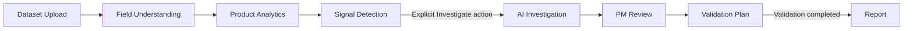
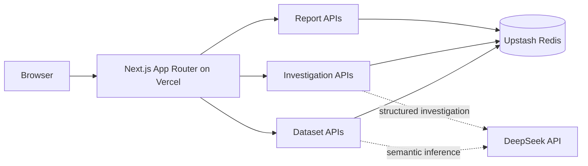

# InsightFlow AI

**An AI-assisted product analytics and diagnosis workspace for product managers and product operations teams.**

[Live demo](https://insightflow-ai-gamma-dun.vercel.app) · [GitHub repository](https://github.com/Renshuxian-ai/insightflow-ai)

## 1. Product Overview

InsightFlow AI helps product teams move from a dataset to a reviewable product conclusion. It is designed for product managers and operators who need to connect product metrics, user behavior, and qualitative feedback without losing the evidence behind an AI-generated explanation.

This is not a conventional BI dashboard. Dashboards describe what changed; InsightFlow AI adds a controlled workflow for deciding which signal deserves investigation, grounding AI analysis in available evidence, validating a working hypothesis, and producing a traceable report. The product keeps **Evidence**, **Observation**, **Inference**, and **Hypothesis** separate so that an AI draft is never presented as a confirmed cause.



## 2. Core Product Capabilities

### Dataset Upload & Field Understanding

- Accepts one UTF-8 CSV or XLSX file, validates its structure, and profiles fields and sample values.
- Produces AI-assisted semantic suggestions for field roles and business meanings, with deterministic inference when the AI provider is unavailable.
- Separates required review from optional uncertainty. Users can accept, edit, exclude, or leave non-blocking fields unresolved.
- Requires the critical field meanings to be reviewed before field understanding can be confirmed.
- Builds and persists the derived analytics context only after confirmation; changing the schema invalidates the previous analytics result.

### Product Analytics

- **Overview** — product-health KPIs, trend context, detected anomalies, user segments, feedback topics, and recent investigations.
- **Trends** — metric changes, ranked signals, comparison context, and supporting evidence.
- **Funnels** — observed step transitions, completion and drop-off, plus version context when the dataset supports it.
- **Retention** — retention windows, cohort views, curves, and segment comparisons when the required identity and time evidence is available.
- **Feedback** — topic volume, trend, sentiment, representative quotes, and linked product-signal context.

The analytics runtime is evidence-aware: when a dataset cannot support a calculation, the affected module is shown as unavailable instead of being filled with demo values.

### AI Diagnostics

- Converts supported uploaded-data signals into typed analytics contexts and `DiagnosticCase` records.
- Preserves metric, segment, behavior, feedback, source, and limitation references used by the diagnosis.
- Treats a detected signal as a candidate problem, not as an Investigation that already exists.

### Investigation

- Creates a Dataset Investigation only after the user explicitly selects **Investigate**; rendering or opening an analytics page does not create lifecycle state.
- Uses DeepSeek for structured, evidence-grounded investigation drafts and bounded tool-calling where the selected analytics surface supports it.
- Validates model output against the selected `DiagnosticCase`, including evidence references and recommendation IDs.
- When DeepSeek is unavailable or returns invalid output, can return a clearly identified deterministic draft built from the same Dataset evidence. It does not substitute Demo evidence.
- Presents evidence used, possible explanations, confidence rationale, uncertainty, a working hypothesis, recommended validation steps, and limitations for PM review.

### Validation

- Lets the PM accept, refine, request more evidence for, or reject the working hypothesis.
- Resolves every production-reachable recommendation through the stable pair `diagnosticCaseId + nextValidationId`.
- Builds an explicit Validation Plan with an objective, method, required evidence, checks, and criteria that support or weaken the hypothesis.
- Keeps plan-template coverage testable: a newly reachable recommendation without a template fails the coverage fixture.
- Moves a persisted Investigation from `Validation ready` to `Validated` only when the validation workflow is completed and its Report is saved.

### Reports

- Requires a completed validation; an AI investigation draft alone cannot create a Report.
- Binds a Dataset Report to the exact persisted Investigation and Investigation result used to produce it.
- Preserves key findings, supporting evidence, limitations, recommended actions, and timestamps.
- Provides a session report library, exact report-detail recovery, deletion, and Markdown export.

## 3. Key Product Design Decisions

### Dataset Mode vs. Demo Mode

- With no confirmed upload, the product runs in **Demo Mode** using clearly identified fixture data.
- Confirming field understanding creates a **Dataset Mode** session backed by derived evidence from that upload.
- Dataset Mode never silently switches to Demo data or Demo `DiagnosticCase` records. Missing evidence stays missing, and an unavailable Dataset session stays unavailable.

This boundary protects trust: a polished answer based on unrelated mock data is worse than an honest unavailable state.

### Signal is not an Investigation

A signal says that a metric, funnel transition, retention comparison, or feedback topic may deserve attention. Creating an Investigation is a separate product decision with storage and lifecycle consequences. The explicit **Investigate** action keeps analytics exploration cheap while preserving user intent and preventing page renders from producing duplicate work.

### Validation before Report

AI analysis produces a working hypothesis, not a final product decision. A PM must review that hypothesis and choose a concrete Validation Plan before completing validation. Only then can the system create a Report. This human-in-the-loop boundary makes assumptions, evidence gaps, and decision criteria visible.

### Fail-closed Dataset behavior

If a confirmed Dataset session cannot be recovered, the application keeps Dataset Mode active and shows `temporarily unavailable`, `expired`, or `could not be recovered` states. It does not fall through to Demo content. Retry is available for transient storage failure; an expired or invalid session requires an explicit **Start new session** action.

## 4. Production Architecture



The browser owns the interaction flow, while Next.js Server Components and Route Handlers enforce mode and lifecycle rules. A `runtimeSessionId` scopes the browser session; a content-derived `datasetIdentity` prevents records from crossing datasets. An HTTP-only cookie acts as the Dataset Mode marker, while Redis remains the source of truth for the recoverable session state.

Dataset sessions are intentionally temporary: derived analytics and `OverviewRuntime` data expire after six hours. Redis provides shared state across Vercel serverless invocations. Multi-key writes and Lua compare-and-set operations keep Dataset, Investigation, and Report transitions consistent under concurrent requests. Production lifecycle state does not depend on a process-local `globalThis` map.

## 5. Serverless Persistence Problem & Solution

### The production failure

Earlier repository revisions kept Dataset analytics sessions, Investigations, and Reports in process-local `globalThis` maps. That appeared stable in a local, single-process development server. On Vercel, however, separate serverless invocations could run in different or recycled processes, so a later request could not reliably recover the state created by an earlier one.

The user-visible result was a broken product journey: analytics could be calculated, but the Dataset, Investigation, or Report might disappear at the next route transition.

### The architectural fix

- Decoupled the HTTP-only Dataset Mode marker from the persisted session document.
- Moved shared lifecycle state to Upstash Redis.
- Persisted the derived analytics context and `OverviewRuntime`, rather than relying on process memory.
- Stored Investigations and Reports under exact runtime-session, dataset, and record identities.
- Added Redis indexes for session-scoped listing without introducing “latest record” recovery.
- Added Lua/CAS mutations so concurrent create, update, validate, and delete operations cannot silently overwrite a newer lifecycle state.
- Added a six-hour data TTL, a short marker grace period for accurate expiry recovery, and an explicit reset path.
- Distinguished a Redis outage from an expired session so transient infrastructure failure is not misreported as data loss.

This was a product-reliability correction driven by a production deployment failure: persistence design directly affected whether users could trust the analysis workflow.

## 6. Reliability & Lifecycle Guarantees

- **No Dataset-to-Demo substitution:** Dataset Mode never falls back to Demo/mock data or Demo diagnostic cases.
- **Read-only rendering:** GET and render paths recover state; they do not create or advance lifecycle records.
- **Explicit creation:** a Dataset Investigation is created only by a user-triggered POST from **Investigate**.
- **Evidence-bound AI:** generated outputs are checked against the selected `DiagnosticCase` and its evidence IDs.
- **Validation gate:** Report creation requires a completed Validation Plan and, for Dataset Mode, a persisted Investigation in `Validation ready` state.
- **Exact recovery:** Investigation and Report detail routes resolve the requested ID; they do not show the latest record as a substitute.
- **Atomic transitions:** Redis Lua/CAS operations reject stale or conflicting lifecycle mutations.
- **Failure semantics:** Redis failure means temporarily unavailable, not expired.
- **Explicit recovery:** expired or invalid Dataset sessions remain fail-closed until the user starts a new session.
- **Template completeness:** the validation coverage fixture requires every production-reachable `nextValidation.id` to resolve to a plan template.

## 7. Tech Stack

- **Next.js 16.3 / App Router** — pages, Server Components, and Route Handlers
- **React 19.2** — interactive product workflows
- **TypeScript 5** — typed datasets, diagnostics, AI output, and lifecycle contracts
- **Tailwind CSS 4** — UI styling
- **Vercel** — serverless deployment
- **Upstash Redis** — shared, TTL-based Dataset, Investigation, and Report persistence
- **DeepSeek (`deepseek-chat`)** — semantic field assistance and structured Investigation generation
- **ExcelJS / csv-parse** — XLSX and CSV ingestion
- **ESLint 9 / eslint-config-next** — static quality checks

## 8. Project Structure

```text
src/
├── app/                    # App Router pages and Dataset/Investigation/Report APIs
├── components/             # Product UI grouped by workflow and analytics surface
└── lib/
    ├── ai/                 # Model registry, providers, tool-calling, and output validation
    ├── analytics/          # Dataset-derived Trends, Funnels, Retention, and Feedback runtimes
    ├── datasets/           # Upload parsing, profiling, semantic review, and Dataset mode
    ├── diagnostics/        # DiagnosticCase types, adapters, fixtures, and navigation contracts
    ├── investigations/     # Investigation identity, lifecycle, and Redis-backed store
    ├── validations/        # PM review, plan templates, plan builder, and coverage fixture
    ├── reports/            # Validated report builder, persistence, views, and Markdown export
    └── redis/              # Client, keys, TTL policy, reset logic, and atomic Lua scripts
scripts/                    # Executable repository fixtures, including validation coverage
```

## 9. Run Locally

Requirements: a current Node.js/npm environment and, for the persisted Dataset workflow, an Upstash Redis database.

```bash
npm install
npm run dev
```

Open [http://localhost:3000](http://localhost:3000).

Create `.env.local` when enabling the connected services:

```dotenv
# Enables DeepSeek-backed semantic suggestions and Investigation generation
DEEPSEEK_API_KEY=your_key_here

# Required for shared Dataset, Investigation, and Report persistence
KV_REST_API_URL=your_upstash_rest_url
KV_REST_API_TOKEN=your_upstash_rest_token
```

Do not commit `.env.local` or real credentials. The UI can demonstrate its product flow with fixture data, while the persisted Dataset lifecycle requires Redis. If DeepSeek is not configured, AI-assisted steps disclose and use their deterministic fallback behavior.

## 10. Quality Checks

```bash
npx tsc --noEmit
npm run lint
npm run test:validation-plan-coverage
npm run build
```

`test:validation-plan-coverage` enumerates the currently reachable Demo, Core Conversion, Dataset Activity, Dataset Retention, Dataset Funnel, and Dataset Feedback recommendations. It fails if any stable recommendation ID lacks a matching Validation Plan template, and it also verifies that the previously missing recommendation IDs can build plans.

## 11. Demo

- **Production:** [insightflow-ai-gamma-dun.vercel.app](https://insightflow-ai-gamma-dun.vercel.app)
- **Source:** [github.com/Renshuxian-ai/insightflow-ai](https://github.com/Renshuxian-ai/insightflow-ai)

Recommended walkthrough:

```text
Explore Demo Mode
→ Upload a CSV or XLSX dataset
→ Review and confirm field understanding
→ Explore Overview / Trends / Funnels / Retention / Feedback
→ Investigate a supported signal
→ Review the AI working hypothesis
→ Generate and complete a Validation Plan
→ Open or export the validated Report
```

## 12. Product Takeaways

- An AI product is not only a model response. It needs explicit states, ownership, failure behavior, and recovery paths.
- Evidence, observation, inference, hypothesis, validation, and report are different artifacts; collapsing them makes confident-looking errors harder to detect.
- Human review is most useful when it changes the workflow: the PM can refine or reject a hypothesis and select how it should be validated.
- Demo data and user-provided data must remain visibly and technically separated.
- Serverless persistence is a product-trust concern. If state disappears between actions, the analytical reasoning is no longer auditable.
- AI fallbacks should preserve provenance and uncertainty, not hide provider failure behind an apparently successful answer.

## 13. Current Scope

InsightFlow AI is a **portfolio project and product MVP**, not a production SaaS offering. It demonstrates a complete, testable product-analysis lifecycle with temporary shared persistence, but it intentionally does not claim to provide:

- authentication or authorization;
- multi-tenant organization and data isolation;
- billing or subscription management;
- a long-term analytics warehouse or raw-event ingestion pipeline;
- enterprise governance, audit controls, or production SLAs; or
- permanent Dataset, Investigation, and Report retention.

Uploaded-data sessions are short-lived and evidence-dependent. The current goal is to make the product reasoning, AI workflow, lifecycle boundaries, and failure states concrete enough to evaluate—not to present the MVP as a finished analytics platform.
